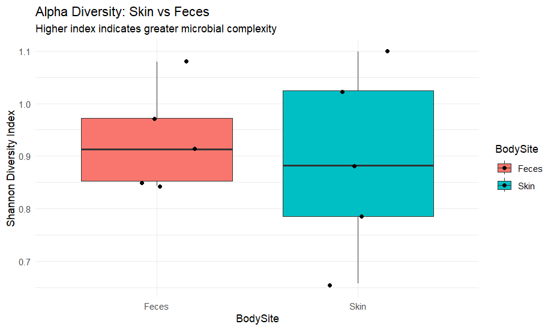
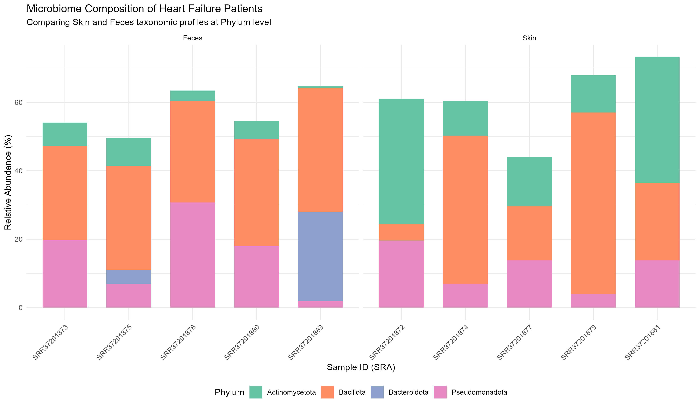

# Human Microbiome Analysis in Heart Failure Patients

## Project Overview
This project analyzes the taxonomic composition of the skin and fecal microbiome in patients with heart failure. The goal is to identify distinct biological signatures and diversity patterns across different body sites.

## Data Source
- **BioProject:** PRJNA1422516
- **Samples:** 10 total (5 Skin, 5 Feces)

## Bioinformatics Pipeline
1. **Quality Control:** FastQC and MultiQC.
2. **Preprocessing:** Adapter trimming and quality filtering using `fastp`.
3. **Taxonomy:** Taxonomic profiling using clade-specific marker genes.
4. **Analysis:** Diversity metrics (Alpha and Beta) and visualization performed in R.

## Key Findings
- **Composition:** Skin samples were dominated by *Actinomycetota* and *Bacillota*, while fecal samples showed a significant presence of *Bacteroidota* and *Pseudomonadota*.
- **Diversity:** Visual clustering in PCoA (Beta Diversity) confirmed distinct microbial communities between body sites.

## Visualizations

### 1. Taxonomic Composition
This stacked bar plot displays the relative abundance of major phyla. We observe that **Actinomycetota** is a hallmark of skin samples, while **Bacteroidota** is characteristic of the fecal microbiome in these patients.

### 2. Alpha Diversity (Shannon Index)
Alpha diversity was calculated to measure within-sample complexity. This boxplot highlights the difference in microbial richness and evenness between the two body sites.

### 3. Beta Diversity (PCoA)
Principal Coordinates Analysis (PCoA) based on Bray-Curtis dissimilarity shows clear clustering. The distinct separation proves that body site is the primary driver of microbial community structure in this study.

